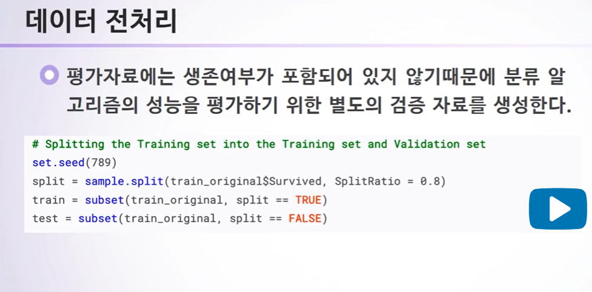

# 7주차

## 미래를 예측하고 싶다면? 알고리즘 알아보기

### 7-1. 알고리즘과 인공지능

- 알고리즘 : 데이터를 기반으로 실생활의 문제에 대한 해답을 제공하는 기술
- 머신러닝 : 통계학과 컴퓨터 공학의 접점 분야로 경험(데이터)를 통하여 자동적으로 향상되는 컴퓨터 알고리즘을 연구하는 분야
- AI분야 대표적 석학 마이클 조단 교수는 Harvard Data Science Review에 투고한 "Artificial Intelligence - The Revolution Hasn't Happened Yet"에서 인공지능(과 데이터 사이언스)는 사실 머신러닝의 또 다른 이름이라고 언급
- 지도학습
  - 인공지능(=머신러닝)이 수행하는 작업은 크게 지도학습과 자율학습으로 나누어지며 지도학습은 다시 분류와 예측으로 나누어진다.
  - 지도학습(Supervised Learning)
    - 분류(Classification) : 사진에서 고양이와 개의 분류
    - 예측(Prediction) : 주식가격 예측, 날씨 예측
- 강 인공지능과 약 인공지능
  - 강 인공지능
    - 자의식을 가진 인공지능으로 명령받지 않은 일도 할 수 있으며 심지어 명령을 거부할 수도 있음
  - 약 인공지능
    - 데이터를 바탕으로 주어진 문제에 대한 답을 찾는 기술(예 : 알파고)
- 빅데이터의 2가지 유형
  - 길쭉한 자료 : n이 큰 경우(표본 크기가 큰 경우)
  - 
  - 뚱뚱한 자료 : p가 큰 경우(parameter의 개수가 많은 경우)

### 7-2. 알고리즘 성능평가

정확도(accuracy) : 평가자료에서 1-오분류 비율

민감도(sensitivity) : 양성환자 중 양성으로 진단된 비율

특이도(specificity) : 음성환자 중 음성으로 진단된 비율

- ROC 곡선
  - 의사결정나무에서는 각 승객의 생존확률을 예측한다.
  - 생존확률이 50% 이상일 경우 생존자로 분류한 결과 민감도와 특이도가 각각 0.78과 0.84였다.
  - 만약 생존자로 분류하는 기준을 보수적으로 잡기 위해 생존할 확률이 70% 이상일 경우만 생존으로 분류한다면 이 경우 민감도와 특이도는 각각 0.5와 0.98이 된다.
  - 이처럼 생존자 분류기준을 변경할 경우 민감도와 특이도의 값이 달라지는데 사람마다 분류기준점이 달라질 수 있으므로 분류기준값에 따른 특이도와 민감도를 제시하는 그림을 ROC곡선이라고 한다.

- 점섬은 훈련자료, 실선은 평가자료
- 대각선보다 위에 있어야 좋은 알고리즘이다.

### 7-3. 과적합과 알고리즘의 문제점

- 교차검증
  - 과적합을 피하기 위해 적절한 복잡도를 가진 모형을 선택해야 한다.
  - 이를 위해서 훈련잘와 별도로 모형의 복잡도를 결정하기 위한 검증자료가 별도로 필요하다.
  - 보통 모형의 복잡도는 조절모수(tuning parameter)를 통해 결정되는데 각각 다른 조절모수의 값을 이용해서 검증자료에서 예측오차를 계산한 후 그 중 가장 작은 예측오차를 제공하는 조절모수를 선택하는 방식이다.
  - 의사결정나무의 경우 조절모수는 가지(조건)의 개수로 생각할 수 있다.

- K-fold 교차검증
  - 1개의 교차자료만으로 조절모수를 결정할 경우 어떤 자료를 교차자료로 사용했는지에 따라 조절모수의 선택에 민감한 영향을 줄 수 있다.
  - 이런 단점을 보완하기 위해 많이 사용하는 방법이 K-fold 교차검증이다.

위의 사진은 훈련자료를 5개로 나누었다. 갈색이 검증자료이고 각각 20%씩 나눴기 때문에 80%의 자료로 검증을 한다. 총 5번을 시행하게 되는 것이고 각각 교차자료가 다르기 때문에 브라이어 지수가 5개가 나오면 이것들의 평균을 구해서 최종 브라이어 지수로 하는 것이다. 여기서는 데이터를 5등분 했으니까 5-fold 교차검증이라고 할 수 있다. 일반적으로는 10등분이나 5등분을 해서 10-fold cross validation 또는 5-fold cross validation 을 많이 한다.

- 그 외 다양한 분류방법들

  - Random Forest
  - Support Vector Machine(SVM)
  - Neural Network
    - 딥러닝과 밀접한 관련
    - 비선형 회귀분석
  - K-nearest Neighbor(KNN)
    - 비슷한 것을 찾는다.
    - 제일 가까운 K개의 이웃을 이용해서 그것을 예측한다.

- 알고리즘의 문제

  - Robutness 이슈

    - 강건성
    - 약간의 변동에도 결과가 급격하게 변화하지 않는다.
    - 

  - 변동성에 대한 고려

    

  - 내재적 편향성

  - 

  - 투명성

  - 

  - Reverse-engineering

### Lab 7. 사례연구 : 타이타닉 승객들의 생존확률

- 분석절차
  - 1. 데이터 전처리
    2. 의사결정나무 적합
    3. Confusion Matrix 와 ROC 곡선을 이용한 결과 평가

