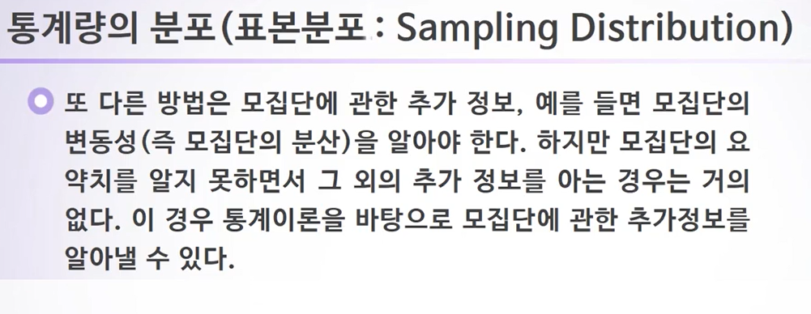

# 8주차

## 확률로 풀어보는 불확실성

### 8-1. 붓스트랩

- 표본의 분포
  - 표본의 크기가 커질수록 표본의 히스토그램이 모집단의 히스토그램과 비슷해짐을 알 수 있다.
- 통계량의 분포(표본분포 : Sampling Distribution)
- 

하지만 복잡한 통계이론을 알지 못하는 경우 쉽게 통계량의 변동성을 알아내는 방법은 없을까?

### 8-2. 확률의 기원과 법칙

- 슈발리에 드 메레(Chevalier de Mere)의 질문

- 확률과 통계
  - 

- 기대돗수나무(Expected Frequency Tree)
  - 

### 8-3. 조건부확률과 확률변수

### Lab8. 붓트랩과 다양한 확률 분포

- qnorm 빨간색 면적의 위치
- dnorm 는 destiny function, 즉 빨간색 영역에서의 꼭대기

- 표본분포는 모집단의 분포와 다를 수 있다.
- 붓스트랩을 사용하여 표본분포를 구할 수 있다.
- 표본의 크기가 커질수록 표본요약치(통계량)은 해당하는 모집단의 모약치(모수)에 가까워진다.

- 서울대 입구역 사거리에서는 하루 평균 1회의 교통사고가 일어난다고 알려져 있다. 오늘 서울대 입구역 사거리에서 교통사고가 일어나지 않을 확률은?

  

  

